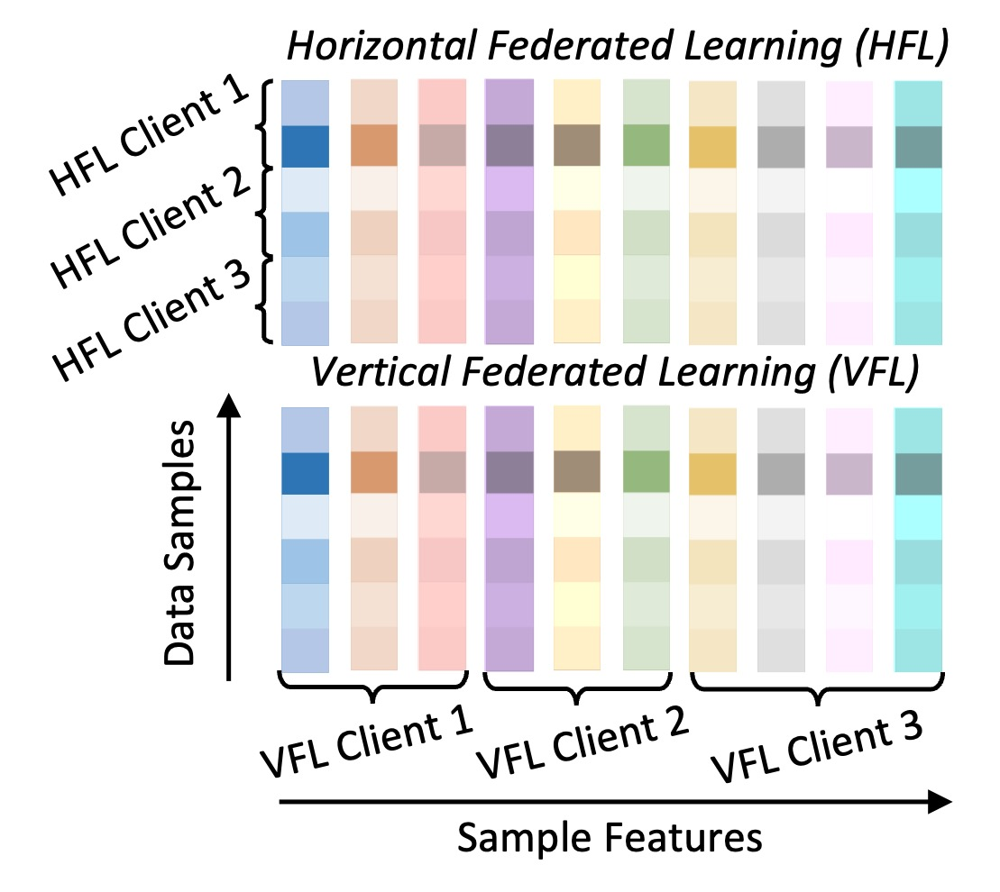
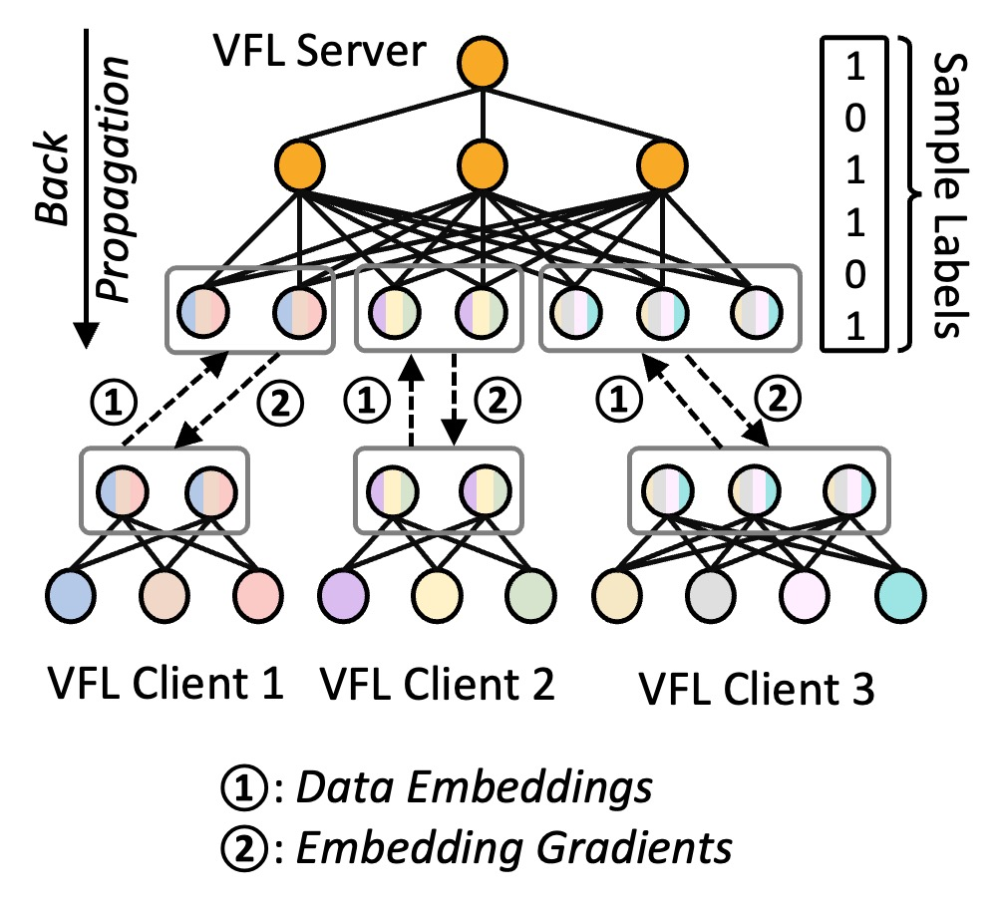

# Vertical Federated Learning


## Introduction 
Vertical federated learning (VFL) enables collaboration among clients that have non-overlapping features but share the same sample IDs, as shown in the following figure.

<p align="center">
  
</p>

As shown in the following figure, in VFL, rather than training the same model architecture and sharing model parameters, each client possesses its embedding model to process its local data sample features and then sends their local embeddings to the server. The server, holding the labels of the client data samples, concatenates the received embeddings to train a central model. It then sends the gradients of the feature embeddings back to the corresponding clients, enabling them to update their local embedding models accordingly. 

<p align="center">
  
</p>


## Installation

```bash
conda create -n vfl python=3.10 --y
conda activate vfl
pip install -r requirements.txt
```

## Case Study

In this case study, we use the diabetes datasets from the ``scikit-learn`` library, which contains ten features of 442 data samples. The labels, integers ranging from 25 to 346, are the responses of interest that quantitatively measure the disease progression. We split the dataset into 80% for training and 20% for validation, and use three VFL clients, where clients 1 and 2 possess three patient features and client 3 possesses four. Each of the three clients as well as the server employs a two-layer perceptron with ReLU non-linear activation for their embedding models.

1. Training the model directly without VFL: [[simulation/baseline.ipynb]](simulation/baseline.ipynb)
2. Direct simulation of VFL in a serial manner. [[simulation/vfl_sim.ipynb]](simulation/vfl_sim.ipynb)
3. Simulation of VFL with defined trainer and aggregator. [[simulation/vfl.ipynb]](simulation/vfl.ipynb)
4. Deploy of VFL among real distributed server and clients APPFL. [[deployment]](deployment/README.md)